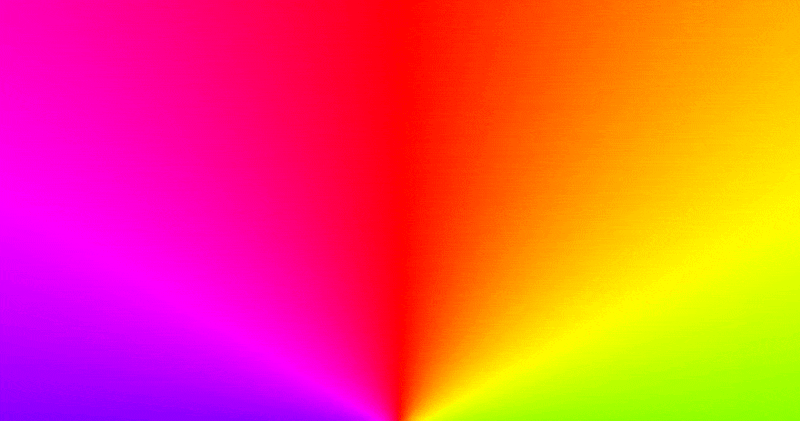

# Free Assets
Click on the GIF to be taken to the designated section for each asset.
## Purple Rectangles

## Night Lightning

## Blinking Lights

## PixaBlue

## Much Clouds

## Hue Wheel

## Cosmic Cliffs

## Sun and Moon

## Solar System

## Mondrian Rectangles

## Polaris

## PixaMisc

## PixaHue

## Blue Marble

## Pillars of Creation

## Crasta Mora

## Random Stars
